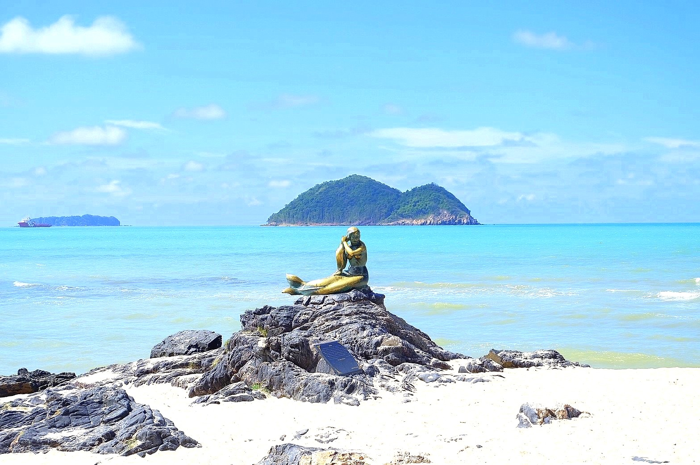
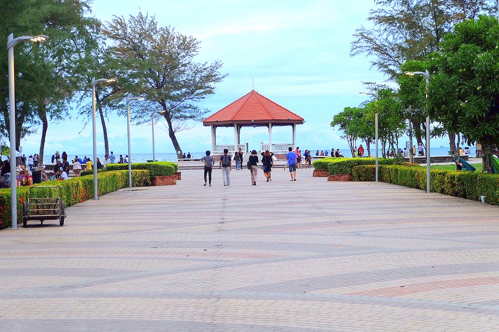
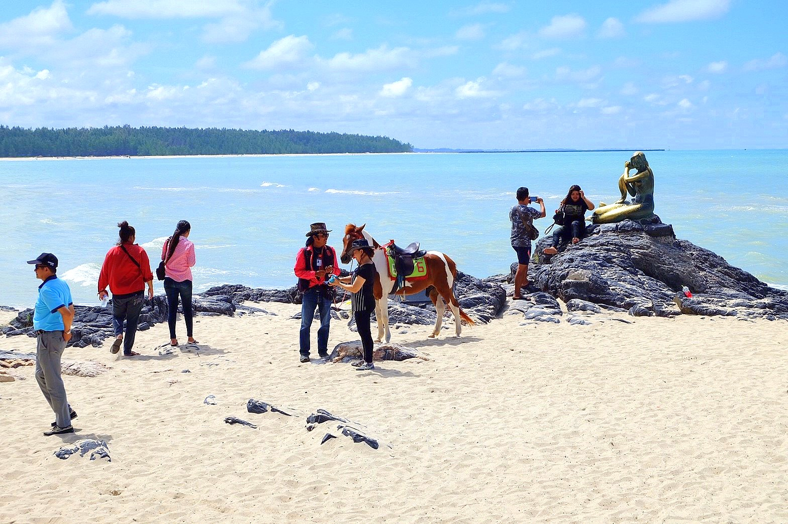
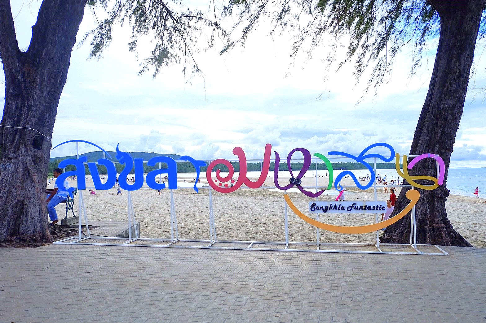
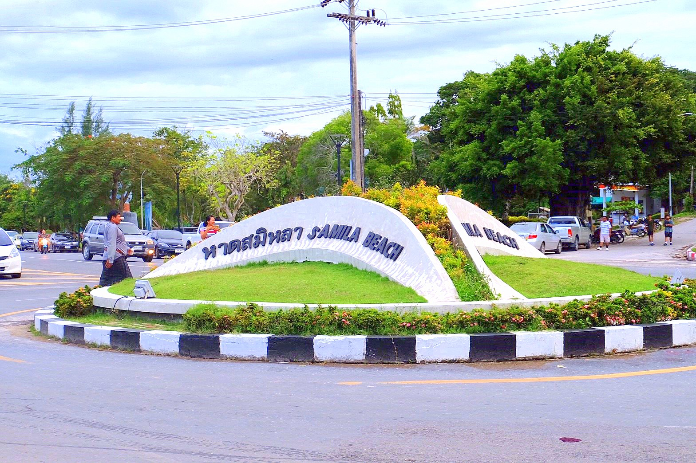
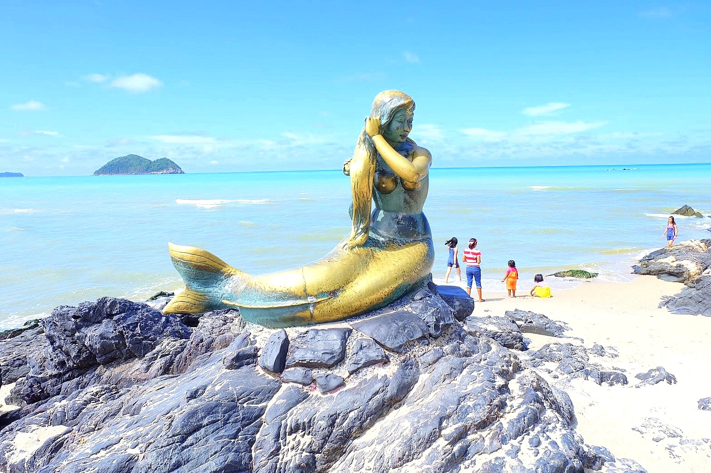
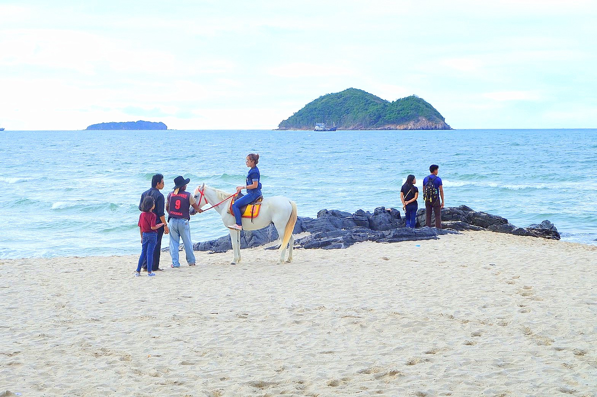
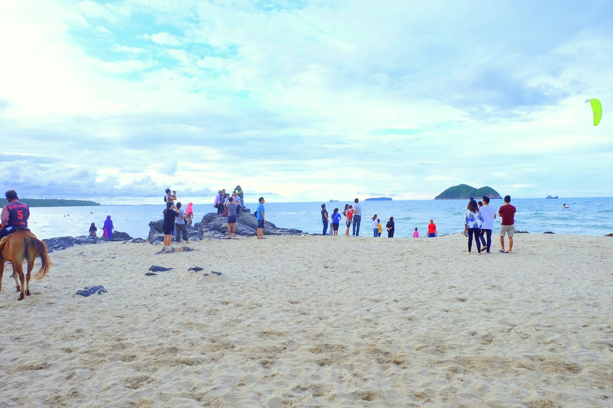

# l<!DOCTYPE html>
<html>
<title>W3.CSS Template</title>
<meta charset="UTF-8">
<meta name="viewport" content="width=device-width, initial-scale=1">
<link rel="stylesheet" href="https://www.w3schools.com/w3css/4/w3.css">

<body>

<!-- Navbar (sit on top) -->

">
  

    <a href="#home" class="w3-bar-item w3-button">Songkhla Go Go</a>
    <!-- Right-sided navbar links. Hide them on small screens -->
    

      <a href="#about" class="w3-bar-item w3-button">About</a>
      <a href="#menu" class="w3-bar-item w3-button">Menu</a>
      <a href="#contact" class="w3-bar-item w3-button">Contact</a>
    

  

<!-- Header -->
<header class="w3-display-container w3-content w3-wide" style="max-width:1600px;min-width:500px" id="home">
  
  

  

</header>

<!-- Page content -->

  <!-- About Section -->
  

    

     
     

   

    

      <h1 class="w3-center">แหลมสมิหลา</h1>
      <h2 class="w3-center">ประวัติและความเป็นมา</h2>

      
 
        แหลมสมิหลาหนึ่งในสถานที่ท่องเที่ยวของจังหวัดสงขลา อยู่ในเขตเทศบาลเมือง ห่างจากตลาดทรัพย์สิน(ตลาดสดเทศบาล) ประมาณ 2.5 กิโลเมตร มีหาดทรายขาวสะอาด
         ทิวสนร่มรื่น จุดเด่นของแหลมสมิหลาคือรูปปั้นนางเงือกอันเป็นสัญลักษณ์ของจังหวัดสงขลา และรูปปั้นหนูแมว โดยรอบบริเวณได้จัดสวนหย่อมไว้ดูร่มรื่นเหมาะเป็นที่นั่งพักผ่อนยามเย็น
         เมี่อมองออกไปในทะเลจะเห็น เกาะหนูเกาะแมว อันเป็นอีกสัญลักษณ์หนึ่งของแหลมสมิหลา ที่มีเรื่องเล่าต่อกันมาว่า “มีพ่อค้าชาวจีนผู้หนึ่งคุมเรือสำเภาเดินทางมาค้าขายระหว่างจีนกับสงขลาเป็นประจำ วันหนึ่งพ่อค้าผู้นี้ได้ซื้อหมากับแมวลงเรือไปเมืองจีนด้วย หมากับแมวอยู่บนเรือนานๆเกิดความเบื่อหน่ายจึงปรึกษาหาวิธีการที่จะกลับบ้าน หมากับแมวได้ทราบว่าพ่อค้ามีดวงแก้ววิเศษที่ทำให้ไม่จมน้ำ แมวจึงคิดอุบายโดยให้หนูไปขโมยแก้ววิเศษของพ่อค้ามา และหนูขอหนีขึ้นฝั่งไปด้วย ทั้งสามว่ายน้ำหนีลงจากเรือโดยที่หนูอมดวงแก้วเอาไว้ในปาก ขณะนั้นหนูนึกขึ้นได้ว่าถ้าถึงฝั่ง หมากับแมวคงจะแย่งเอาดวงแก้วไปจึงคิดที่จะหนี ฝ่ายแมวซึ่งว่ายตามหลังมาก็คิดเช่นกัน จึงว่ายน้ำรี่ไปหาหนู หนูตกใจว่ายน้ำหนีไม่ทันระวังตัว ดวงแก้ววิเศษที่อมไว้จึงตกลงจมหายไปในน้ำ หนูและแมวต่างก็หมดแรงจมน้ำตายกลายเป็นเกาะหนูเกาะแมวอยู่ที่อ่าวหน้าเมือง ส่วนหมาตะเกียกตะกายว่ายน้ำไปจนถึงฝั่งและสิ้นใจตายด้วยความเหน็ดเหนื่อยกลายเป็นหินบริเวณเขาตังกวนอยู่ริมอ่าวสงขลา ดวงแก้ววิเศษที่หล่นจากปากหนูแตกละเอียดกลายเป็นหาดทรายแก้วอยู่ทางด้านเหนือของแหลมสน”

    

  

  

  <!-- Menu Section -->
  

    

      <h1 class="w3-center w3-card-2">รายละเอียด</h1> 
      <h4>เวลาเปิดทำการ :</h4>
      
24 Hours
 

      <h4>ที่อยู่</h4>
      
อยู่ในเขตเทศบาลเมือง ห่างจากตลาดทรัพย์สิน (ตลาดสดเทศบาล) ประมาณ 2.5 กิโลเมตร อำเภอเมืองฯ จังหวัดสงขลา
 

      <h4>การเดินทาง</h4>
      
หาดสมิหลา อยู่ในเขตเทศบาลนครสงขลา ห่างจากตลาดสดเทศบาลเพียง 2.5 กม. การเดินทางสะดวกมีถนนเลียบชายหาด ตลอดแนว
        จากอำเภอหาดใหญ่สามารถใช้รถประจำทางสายหาดใหญ่ - สงขลาได้หากอยู่ในเมืองก็มีรถสองแถวไปชายหาด
 

 
 

    

    

      
       
      
    

  

<h1 class="w3-center w3-card-2">รูปภาพเพิ่มเติม</h1> 
 
 
 
 
 

 

<!-- End page content -->

</body>
</html>
